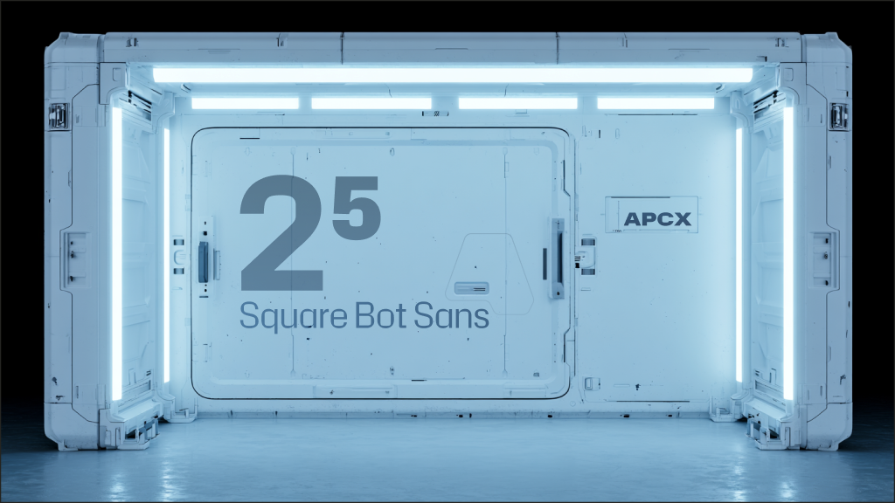

# Square Bot Sans

Square Bot Sans is a squared, technical sans serif type family derived from Hubot Sans and extended as a multi-axis Glyphs source. The current source supports width, weight, and italic axes, with static Condensed, Normal, and Expanded families plus a variable font build.

This repository contains the public source package, installable release fonts, webfonts, project documentation, and contribution templates.



## Files

- `sources/SquareBotSans.glyphspackage` is the Glyphs source.
- `fonts/otf/` contains static desktop OTF exports.
- `fonts/webfonts/` contains static WOFF2 webfont exports.
- `fonts/variable/` contains the local/GitHub variable TTF and WOFF2 exports, with italic exposed as roman and italic positions.
- `fonts/googlefonts/` contains the Google Fonts candidate TTF exports, split into Roman and Italic variable fonts.
- `docs/` contains publication notes, coverage notes, and release-readiness review material.
- `documentation/` contains Google Fonts-style family description material.
- `documentation/article/` contains the poster asset used by the README and Google Fonts article package.

## Install

For desktop use, install the OTF files from `fonts/otf/`.

For web use, copy the WOFF2 files from `fonts/webfonts/` or `fonts/variable/` into your project and reference them with `@font-face`.

```css
@font-face {
  font-family: "Square Bot Sans";
  src: url("./fonts/webfonts/SquareBotSans-Regular.woff2") format("woff2");
  font-weight: 400;
  font-style: normal;
  font-display: swap;
}
```

Variable font example:

```css
@font-face {
  font-family: "Square Bot Sans";
  src: url("./fonts/variable/SquareBotSans[ital,wdth,wght].woff2") format("woff2-variations");
  font-weight: 200 900;
  font-stretch: 80% 120%;
  font-style: normal;
  font-display: swap;
}

.sample {
  font-family: "Square Bot Sans", sans-serif;
  font-variation-settings: "ital" 1, "wdth" 100, "wght" 500;
}
```

Google Fonts candidate CSS uses separate Roman and Italic files:

```css
@font-face {
  font-family: "Square Bot Sans";
  src: url("./fonts/googlefonts/SquareBotSans[wdth,wght].ttf") format("truetype-variations");
  font-weight: 200 900;
  font-stretch: 75% 125%;
  font-style: normal;
}

@font-face {
  font-family: "Square Bot Sans";
  src: url("./fonts/googlefonts/SquareBotSans-Italic[wdth,wght].ttf") format("truetype-variations");
  font-weight: 200 900;
  font-stretch: 75% 125%;
  font-style: italic;
}
```

## Current Release Fonts

The checked-in static release assets currently include upright and italic OTF and WOFF2 exports:

- `SquareBotSans`: ExtraLight, Light, Regular, Medium, SemiBold, Bold, ExtraBold, Black, plus matching Italics
- `SquareBotSansCondensed`: ExtraLight, Light, Regular, Medium, SemiBold, Bold, ExtraBold, Black, plus matching Italics
- `SquareBotSansExpanded`: ExtraLight, Light, Regular, Medium, SemiBold, Bold, ExtraBold, Black, plus matching Italics

The local/GitHub variable release keeps width and weight interpolation, with italic presented as the two available positions: `ital` 0 and `ital` 1. The Google Fonts candidate build follows Google Fonts practice by splitting Roman and Italic variable TTFs and using `ital` only for STAT/style linking.

Note: the italic version of Square Bot Sans is in heavy development, and modifications may occur.

## Source

Open `sources/SquareBotSans.glyphspackage` in Glyphs 3. Do not edit package files by hand. Make outline, spacing, kerning, feature, and instance changes in Glyphs so generated package data stays consistent.

Current live source inventory:

- Release target: 2.009
- Glyphs source version: 2.009 currently reported by Glyphs.
- UPM: 1000
- Axes: `wdth`, `wght`, `ital`
- Masters: 12
- Instances: 49
- Glyphs: 959 total, 921 exporting, 574 encoded
- OpenType features: `aalt`, `ccmp`, `locl`, `numr`, `dnom`, `frac`, `ordn`, `pnum`, `tnum`, `zero`, `c2sc`, `smcp`, `case`, `dlig`, `liga`, `ss01`, `ss02`, `ss03`, `ss04`, `ss05`, `ss06`
- Discretionary ligatures include technical/code operators such as `<-`, `->`, `=>`, `=<`, `!=`, `>=`, `<=`, `<>`, `<|`, and `|>`.

## Validation

Recommended checks before release:

```sh
make build
fontbakery check-universal --skip-network fonts/otf/*.otf fonts/variable/*.ttf fonts/googlefonts/*.ttf
make test-googlefonts
make test-googlefonts-local
```

`make test-googlefonts` runs the official Google Fonts profile against the ignored `build/googlefonts/squarebotsans/` staging directory. Both the local/GitHub variable release and the Google Fonts candidate use the family name `Square Bot Sans`.

Also confirm that the README snippets reference files that exist and that all release fonts parse with fontTools.

## Specimen PDF Document

The print specimen is generated from editable source files in `specimen-src/`.

Note: the reusable specimen-generation tool is not published yet. Until it is released, regenerate the Square Bot Sans specimen with the local scripts checked into this repository rather than installing `font-specimen` from a package registry.

- Edit `specimen-src/css/base.css` for tokens, page shell, running headers, footers, and shared type styles.
- Edit `specimen-src/css/pages.css` for page-specific composition: cover, axes, instances, glyph boards, feature pages, final page, and back cover.
- Edit `specimen-src/css/formats.css` for A4 and US Letter dimensions and format-specific spacing.
- Edit `specimen-src/templates/base.html`, `specimen-src/templates/page.html`, and `specimen-src/templates/pages/*.html` for HTML structure.
- Edit `specimen-src/data/*.yaml` for human-authored content and `specimen-src/data/*.json` for mechanical glyph or instance data.
- Do not make lasting edits directly in `specimen-squarebot-sans.html` or `specimen-squarebot-sans-letter.html`; those files are generated and will be overwritten.

Python keeps the dynamic document logic:

- `tools/specimen_data.py` loads and validates YAML/JSON data.
- `tools/specimen_components.py` renders repeated components and generated pages.
- `tools/build_specimen.py` inlines CSS, embeds the variable WOFF2 as base64, numbers pages, and writes the root HTML files.
- `tools/specimen_dev_server.py` serves live previews with external CSS and local font files.
- `tools/export_specimen_pdf.mjs` exports the HTML files to browser-rendered PDFs with selectable/vector text.
- `tools/convert_specimen_cmyk.sh` converts the browser PDFs to CMYK with Ghostscript.
- `tools/build_specimen_print.sh` runs the complete HTML -> PDF -> CMYK pipeline.

Generated document files:

- `specimen-squarebot-sans.html`: A4 landscape HTML preview.
- `specimen-squarebot-sans-letter.html`: US Letter landscape HTML preview.
- `specimen-squarebot-sans.pdf`: A4 browser PDF.
- `specimen-squarebot-sans-letter.pdf`: US Letter browser PDF.
- `specimen-squarebot-sans-cmyk.pdf`: A4 CMYK PDF.
- `specimen-squarebot-sans-letter-cmyk.pdf`: US Letter CMYK PDF.

For live design preview, run:

```sh
python3 tools/specimen_dev_server.py
```

Then open:

```text
http://127.0.0.1:8080/a4
http://127.0.0.1:8080/letter
```

The dev server auto-refreshes when templates, CSS, YAML/JSON data, or specimen Python modules change. Use browser devtools to inspect the actual HTML/CSS:

- Chrome: `View -> Developer -> Developer Tools`
- Shortcut: `Command-Option-I`
- Use the element picker to select a page section, table cell, glyph, footer, or cover wordmark.

To view the generated self-contained HTML files directly:

```sh
open specimen-squarebot-sans.html
open specimen-squarebot-sans-letter.html
```

To regenerate HTML only:

```sh
python3 tools/build_specimen.py
```

To regenerate HTML, PDFs, and CMYK PDFs:

```sh
tools/build_specimen_print.sh
```

Useful places to edit:

- Format-level page dimensions and global scale variables: `specimen-src/css/formats.css`.
- Global page shell, running header, footer, and page body: `.page`, `.running-header`, `.page-footer`, `.page-body`.
- Cover wordmark: `.cover-wordmark`, `.cover-wordmark span`, `.wordmark-b`, and the inline `font-variation-settings` in the first page markup.
- Red back cover: `.back-cover-page` and `.back-cover-mark`.
- Instance pages: `.instance-page-layout`, `.instance-map`, `.instance-column`, `.instance-cell`, `.instance-sample`.
- Glyph preview boards and alternate tables: `.glyph-board`, `.glyph-cell`, `.glyph-mark`, `.glyph-name`, `.alternate-board`.
- Per-format corrections: rules prefixed with `.format-a4` or `.format-letter`.

When adjusting typography manually, prefer small changes to CSS variables, selectors, HTML partials, or YAML values. The live preview should refresh automatically. To regenerate HTML only:

```sh
python3 tools/build_specimen.py
```

Refresh the HTML preview and inspect again. When the HTML looks right, run the full pipeline:

```sh
tools/build_specimen_print.sh
```

For visual PDF checks, render selected pages from the CMYK PDF with Ghostscript:

```sh
gs -q -dSAFER -dBATCH -dNOPAUSE -sDEVICE=png16m -r120 \
  -dFirstPage=5 -dLastPage=5 \
  -sOutputFile=tmp/pdfs/specimen-checks/page-05-check.png \
  specimen-squarebot-sans-letter-cmyk.pdf
```

The generated HTML embeds `fonts/variable/SquareBotSans[ital,wdth,wght].woff2` as a base64 data URL, so the specimen can be opened without external font or network dependencies.

## License

Square Bot Sans is licensed under the SIL Open Font License, Version 1.1. See `OFL.txt`.

Square Bot Sans is derived from Hubot Sans. The public Square Bot Sans distribution does not reserve Square Bot Sans as a Reserved Font Name.
